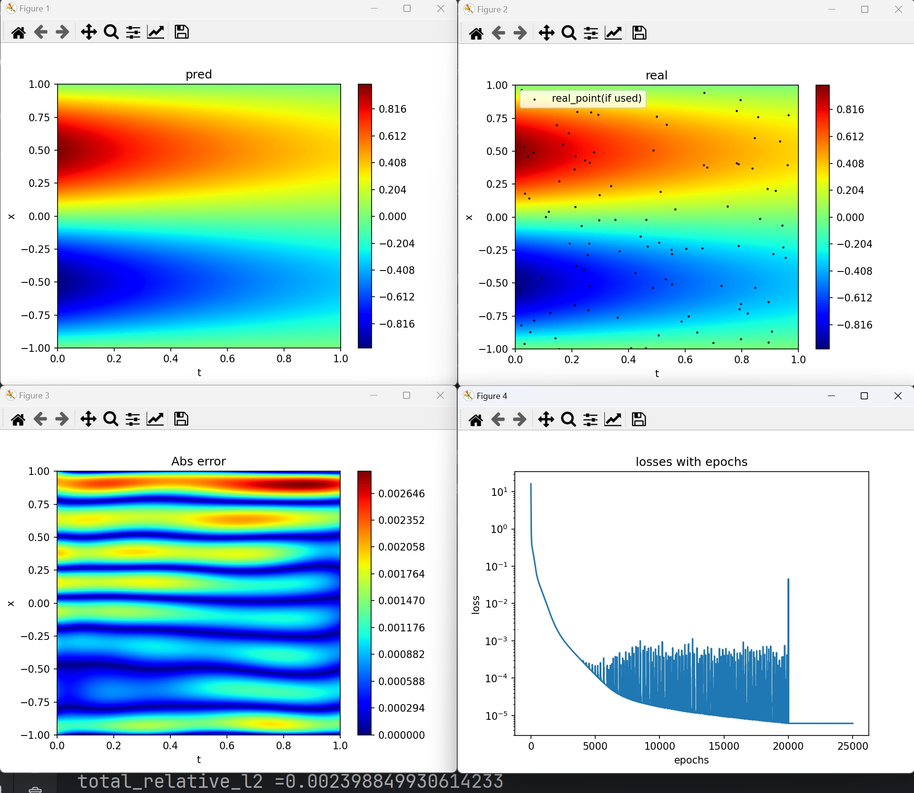

# 一个简易的模块化物理信息神经网络实现(PINN)

## 简介

本项目利用pytorch实现了一个简易的模块化PINN，凭此可以快速的实现一些简易的PINN。

## 引用

<[ZzYyPp47/Solving_Allen-Cahn_with_Adaptive_PINN: 复现CICP论文提出的几种改进PINN性能的方法 (github.com)](https://github.com/ZzYyPp47/Solving_Allen-Cahn_with_Adaptive_PINN)>

## 更新

### 2024.3.18：

`test.py`:引入画图辅助函数;默认激活函数变为$Tanh()$;默认使用$Adam+L-BFGS$进行优化;加入$L_2$误差的计算;loss$改为对数图

`data.py`:改为继承Dataset;从而允许使用dataloader进行mini-batch训练

`loss.py`:新增了pointcontainer容器;从而允许以None point进行初始化;新增了update_point方法;从而允许在过程中增加新的点

`pinn.py`:删去了冗余的point成员;增加了$L-BFGS$​的闭包函数;增加了train方法;从而允许使用最基本的训练模块;将save方法抽离

### 2024.3.7:

增加了cudnn基准，和一些提示信息。

### 2024.2.20:

为ResNet添加了初始化,添加了加载模型的路径和提示信息。

## 代码结构

对于上述的代码，简述以下几个关键部分：

1. `NN` 中的各个`.py`，定义了一些基本的神经网络的类模型，具体搭建方法参考文件内部注释。
2. `data.py` 是数据的生成文件，创建了点集类`point`，其主要功能是产生一些随机数，用于PINN所需的边界条件训练点、初始时刻训练点、内部训练点、精确label训练点
3. `loss.py` 是定义了损失函数类的文件，这里定制了特定的损失函数，并把损失函数封装成了`LossCompute`类。
4. `pinn.py` 是使用上述定义的网络结构、数据和损失函数进行训练的主程序，其中的`pinn`类中实现了模型的训练、模型参数的保存等功能。
6. `test.py`是项目的入口，这里完成所有参数的初始化及后续的数据处理，提供了设置随机种子、设置随机化方法以及读取模型参数的功能。

具体来看，使用这4个文件实现的流程如下：

1. 首先，需要在`test.py`文件中确定训练的一些参数，例如随机种子、训练的周期总数、$loss$阈值、损失函数、模型、数据点、优化器、权重初始化方式、损失权重和计算设备。然后以上述参数创建一个`pinn`对象。

2. 调用`pinn`对象中的`train()`方法，开始训练。在训练中，根据设定的总周期数进行循环，在每一次循环中，计算损失函数，并进行反向传播和参数更新。

3. 在`train()`方法中，可以对模型进行保存，并且模型的参数、优化器的状态、当前训练的周期数以及当前的损失值都会被保存下来。这样的话，当想要接着之前的状态继续训练模型、或者使用训练好的模型进行预测时，就可以直接加载之前保存的模型。 

4. 直接加载刚刚训练所保存的参数(或者加载之前训练所保存的参数)，并进行后续预测及绘图。

上述就是这四份代码文件的基本用法和使用流程，具体的参数设置需要根据实际的需求和数据情况进行设置。

## 运行方法

直接运行`test.py`即可，程序将会用PINN求解下述示例PDE：
$$
\left\{
\begin{aligned}
&\frac{\partial u}{\partial t}=-u\\
&u(x=1,t)=0\\
&u(x=-1,t)=0\\
&u(x,t=0)=\sin (\pi x)
\end{aligned}
\right.
$$
精确解为$u=e^{-t}\sin (\pi x)$

所使用的参数可在`test.py`中找到

## 编译条件

python 3.12.2

pytorch 2.2 +cu12.1

一点点运气+良好的心态

## 运行结果

$L_2误差为0.0041590589098632336$

## 注意事项

1.即便设置了相同的随机种子，哪怕使用同一机器的不同设备(如GPU:0和GPU:1、GPU和CPU)，最终结果仍可能**不同!**

2.针对不同的方程和条件,`point`,`LossCompute`类可能需要重写

## 物理信息神经网络简介(PINN)

不妨在域$\Omega\times T=[-1,1]\times[0,1]$上定义一个通用的二阶PDE方程:
$$
\left\{
\begin{aligned}
&\mathcal{F}(u,\nabla u ,\nabla^2 u )=0\\
&u(x=1,t)=f(t)\\
&u(x=-1,t)=g(t)\\
&u(x,t=0)=h(x)
\end{aligned}
\right.
$$

### loss

$$
\underset{\theta^*\in\Theta}{\arg \min}\ w_1\mathcal{L}_{pde}+w_2\mathcal{L}_{ini}+w_3\mathcal{L}_{bound}+w_4\mathcal{L}_{real}
$$

$$
\mathcal{L}_{pde}:=\frac{1}{N_{pde}}\sum_{i=1}^{N_{pde}}|\mathcal{F}(\mathcal{N}(x_i,t_i,\theta))|^2\\
\mathcal{L}_{ini}:=\frac{1}{N_{ini}}\sum_{i=1}^{N_{ini}}|\mathcal{F}(\mathcal{N}(x_i,0,\theta))-h(x_i)|^2\\
\mathcal{L}_{bound}:=\frac{1}{N_{bound}}\sum_{i=1}^{N_{bound}}|\mathcal{F}(\mathcal{N}(x_i=\pm1,t_i,\theta))-(f或g)(x_i)|^2\\
\mathcal{L}_{real}:=\frac{1}{N_{real}}\sum_{i=1}^{N_{real}}|\mathcal{F}(\mathcal{N}(x_i,t_i,\theta))-u(x_i,t_i)|^2
$$

其中$\mathcal{N}(x,t,\theta)$代表以给定的$\theta$为参数的神经网络,输入$x,t$所产生的输出,其对应偏导通过自动微分机求得,$\{x_i,t_i\}_{i=1}^N$是给定的训练集,$\Theta$代表神经网络所有可能的参数$\theta$所构成的集合,$u(x,t)$代表精确解,$w_i$代表各损失的权重

如果$w_4\ne 0$(使用$\mathcal{L}_{real}$)则为弱监督学习，否则为无监督学习。

